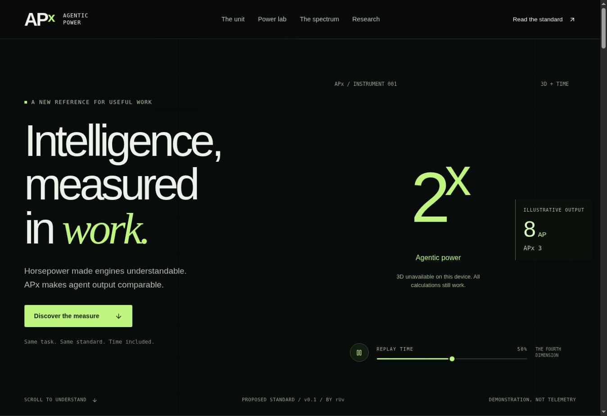

[](https://apx-agentic-power.ruv.chatgpt.site)

# APx: Agentic Power for AI Agent Productivity Benchmarking

APx measures how much verified work an AI agent system delivers compared with a human reference performing the same task. This repository includes the measurement specification, runnable evaluation harness, and interactive Three.js website.

[Explore the live experience](https://apx-agentic-power.ruv.chatgpt.site) · [Read the specification](docs/APx-Specification.md)

## APx in simple terms

Think of Agentic Power as horsepower for useful agent work. If a matched human reference needs eight hours for a task and the agent system delivers the same accepted result in one complete elapsed hour, it achieves **8 AP** for that task. Review and correction belong inside the workflow time boundary. Cost and human supervision are reported alongside throughput.

APx is the exponent: every increase of one means twice the output rate. 1 AP corresponds to APx 0, 2 AP to APx 1, 4 AP to APx 2, and 8 AP to APx 3.

An agent workday measures eight aggregate runtime hours. APx compares accepted output with a measured human reference. Agent count, runtime and lines of code alone cannot establish productivity.

## Quick start

Requires Node.js 22 or newer. The standalone tutorial needs no dependencies, API keys or paid model calls.

```bash
git clone https://github.com/ruvnet/APx.git
cd APx
node benchmark/bin/apx.mjs demo | node benchmark/bin/apx.mjs evaluate -
```

The expected tutorial result is **9 AP**, or **APx approximately 3.17**, using synthetic human baselines and workflow durations. This checks scoring behavior, not real workforce productivity.

## Measure your own agent workflow

1. Choose a specific job and define its acceptance requirements.
2. Measure a relevant human reference group with a documented protocol.
3. Record the agent workflow's complete elapsed time, costs, retries and human assistance.
4. Independently evaluate the result against the same requirements.
5. Bind evidence to the exact task and artifact, then calculate AP and APx.

Start with the [benchmark contract](benchmark/docs/CONTRACT.md). Scores apply to the task, cohort and evaluation setup used. They do not establish general intelligence or universal worker replacement.

## Reference formula

A proposed reference measure for useful human and agent output, with a cinematic Three.js explanation and a runnable benchmark.

AP = accepted reference human work hours / complete elapsed hours.
APx = log₂(AP).

At 8 AP, APx is 3. The quantity is task and cohort specific, not an intelligence score.

## Open the specification

Read [APx specification](docs/APx-Specification.md), [research brief](docs/APx-Research.md), and [benchmark contract](benchmark/docs/CONTRACT.md). All example cohorts, workflow durations and productivity values are synthetic. rUv’s personal score is not measured.

## Run the benchmark

Node 22 or newer. No dependencies, model access, or API key required for the tutorial.

```bash
node benchmark/bin/apx.mjs demo
node benchmark/bin/apx.mjs demo | node benchmark/bin/apx.mjs evaluate -
cd benchmark
node --test test/core.test.mjs .harness/generate.test.mjs
node src/mcp.mjs
```

The tutorial executes three bounded toy computations. Their actual local runtime is distinct from synthetic human calibration and workflow time. The result is 9 AP and APx about 3.169925, explicitly synthetic and uncertified.

Native build governance check, requiring access to the pinned public package:

```bash
npx -y @metaharness/darwin@0.10.2 bench verify .harness/bench.development.json
```

This verifies a visible conformance suite hash. It does not create a hidden occupational holdout or run evolution.

## Integration boundaries

Ruflo coordinates. MetaHarness governs build evaluation. Autogenous and ruClip have explicit local APx contract adapters, not a claim of live native compatibility. Independent human calibration and acceptance remain external trust boundaries. The scorer never issues a certificate or deployment authority.

The package includes twelve proposed task profiles. None is a calibrated occupational benchmark. All high stakes profiles are research, administration, or simulation only.

## Site

[Open the animated APx explainer](https://apx-agentic-power.ruv.chatgpt.site). To run it locally, use `npm ci` followed by `npm run dev`. The standalone benchmark works independently of this site.

The hero screenshot shows the live site's fallback because 3D rendering was unavailable in the capture browser.

The Site uses the supplied Vinext/React project, Three.js 0.180.0, physically based lighting and materials, time replay controls, accessible UI primitives, responsive layouts, and a reduced motion path. The calculator is cross checked against the reference kernel.

```bash
npm run build
node --test tests/*.test.mjs
npx tsc --noEmit --project tsconfig.apx.json
```

Use the Sites lifecycle helpers for hosting. Do not place credentials in the repository.

## Verification and remaining limits

See [verification](docs/VERIFICATION.md). The tested boundaries include safety ineligibility, duplicate aliases, measurement receipt binding, incomplete tasks, unmetered costs, and human labor regression.

Hashes and declarations do not prove truth. The current bootstrap interval is conditional on a frozen baseline and excludes population calibration uncertainty. No live Autogenous or ruClip service, paid model benchmark, or human cohort was exercised. Browser visual QA was not requested and is not claimed.

APx is distinct from Mercor’s APEX benchmark family. No naming clearance, standards adoption, or IP novelty claim is made.

## Architecture decisions

The implementation records major choices as reviewable ADRs:

1. [Accepted reference throughput with a logarithmic presentation](benchmark/docs/ADR-001.md)
2. [Evidence bound acceptance and fail closed scoring](benchmark/docs/ADR-002.md)
3. [Progressive disclosure for the APx explainer](benchmark/docs/ADR-003.md)
4. [Separate MetaHarness execution from APx measurement](benchmark/docs/ADR-004.md)

## APx MetaHarness

The [APx MetaHarness](benchmark/metaharness/README.md) turns versioned task packs into native Darwin suites, freezes measurement context, scores evidence bound receipts and applies paired promotion gates. It keeps task execution separate from APx scoring so a candidate cannot rewrite its own evaluator.

    cd benchmark
    node metaharness/bin/apx-metaharness.mjs compile metaharness/specs/software.development.json
    node metaharness/bin/apx-metaharness.mjs demo
    node metaharness/bin/apx-metaharness.mjs demo | node metaharness/bin/apx-metaharness.mjs promote -
    node --test metaharness/test/metaharness.test.mjs

Created by [rUv](https://github.com/ruvnet) for reproducible AI agent evaluation across jobs, functions and industries.
